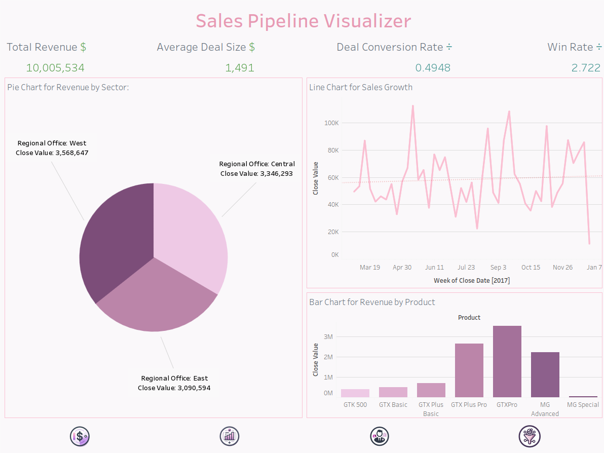

# Introduction

## Purpose of the Document

This document provides comprehensive documentation of the sales
dashboards developed using Tableau. It is intended for sales managers,
business executives, and analysts who will be using these dashboards to
monitor and analyze sales performance.

## Overview of the Sales Dashboard

The sales dashboards include the Homepage Dashboard, Revenue Dashboard,
Product Performance Dashboard, Sales Team Dashboard, and Pipeline
Analysis Dashboard. Each dashboard is designed to provide insights into
different aspects of the sales process, from overall revenue to
individual sales agent performance.

## Importance of Sales Dashboards

Sales dashboards are crucial for making data-driven decisions. They
allow for real-time tracking of key performance indicators (KPIs),
identification of trends and patterns, and optimization of sales
strategies.

## Data Sources

The dashboards integrate data from a fictional company's CRM system,
which is available on Kaggle. The dataset includes information about
customer interactions, sales activities, and opportunities. The data was
cleaned, transformed, and integrated using Pandas in a separate Python
notebook file, which is [available on
GitHub](https://github.com/LAlto96/sales-analytics-dashboard).

### About the Dataset

**Description:** This dataset contains information about customer
interactions, sales activities, and opportunities from a fictional
company's CRM (Customer Relationship Management) system. The dataset is
designed to help data scientists and analysts understand the sales
process, identify trends and patterns, and build predictive models to
improve sales performance.\
\
**Features:**

-   Customer information (demographics, firmographics, etc.)

-   Sales activities

-   Opportunity data (deal size, stage, probability, etc.)

-   Product/service information

-   Sales team and performance metrics

-   Time-series data (daily/weekly/monthly sales, etc.)

**Use Cases:**

-   Predicting won/lost opportunities

-   Forecasting deal size

-   Identifying key drivers of sales performance

-   Optimizing sales team performance

-   Analyzing customer behavior and preferences

This dataset is perfect for data scientists, analysts, and students
looking to practice their skills in:

-   Predictive modeling

-   Data visualization

-   Sales analytics

-   Customer relationship management

Get started: Download the dataset and start exploring!

## Dashboard Specifications

### Dashboard Requirements

**Key Metrics and KPIs:**

-   Total Revenue

-   Deal Conversion Rate

-   Average Deal Size

-   Sales by Product

-   Top Performing Sales Agents

-   Sales Pipeline Status

-   Win Rate

-   Average Sales Cycle Length

-   Revenue by Sector

-   Customer Acquisition Cost (CAC)

-   Customer Lifetime Value (CLV)

-   Lead Response Time

-   Deal Stage Duration

-   Regional Sales Performance

-   Sales Forecast Accuracy

**User Stories:**

-   As a Sales Manager, I want to see the total revenue generated by the
    sales team to assess overall performance.

-   As a Business Executive, I want to analyze the deal conversion rate
    to understand the efficiency of the sales process.

-   As a Potential Client, I want to see the top-performing products to
    understand the company's product strengths.

-   As a Regional Manager, I want to monitor the performance of sales
    agents in my region to provide targeted support and training.

-   As a CEO, I want to see the win rate to understand the overall
    success rate of our sales efforts.

-   As a Sales Director, I want to analyze the average sales cycle
    length to identify bottlenecks in the sales process.

-   As a Marketing Manager, I want to understand the customer
    acquisition cost to evaluate the efficiency of our marketing
    campaigns.

-   As a Financial Analyst, I want to calculate the customer lifetime
    value to help with financial forecasting and budgeting.

-   As a Sales Trainer, I want to review the lead response time to
    improve training programs for quicker lead engagement.

-   As a Regional Manager, I want to compare sales performance across
    different regions to identify high and low performing areas.

-   As an Operations Manager, I want to track deal stage duration to
    optimize the sales process and reduce delays.

-   As a Sales Analyst, I want to assess sales forecast accuracy to
    improve our sales planning and predictions.

-   As a Business Development Manager, I want to see revenue by sector
    to target high-potential industries for growth.

## Structure of the Document

This document is organized into several sections, each covering a
specific dashboard:

-   Homepage Dashboard: Overview and key metrics.

-   Revenue Dashboard: Detailed revenue metrics and trends.

-   Product Performance Dashboard: Insights into product sales and
    performance.

-   Sales Team Dashboard: Analysis of sales agent performance.

-   Pipeline Analysis Dashboard: Visualization of the sales pipeline
    stages and performance.

# Homepage Dashboard

{width="80%"}

The Homepage provides a comprehensive overview of the company's revenue
performance. It includes key metrics and visualizations that help in
understanding the revenue trends, distribution across different regions,
and performance of various products.

## Key Metrics

The key metrics displayed in the Homepage are:

-   **Total Revenue:** This metric shows the total revenue generated
    over a specified period.

-   **Average Deal Size:** This metric indicates the average revenue per
    deal.

-   **Deal Conversion Rate:** This metric represents the percentage of
    deals that were successfully closed.

-   **Win Rate:** This metric shows the percentage of deals won out of
    the total deals engaged.

## Visualizations

The Homepage includes the following visualizations:

-   Pie Chart for Revenue by Sector:

-   Line Chart for Sales Growth:

-   Bar Chart for Revenue by Product:

Both the bar chart and the pie chart can act as filters for the entire
Homepage. Users can click on a specific segment of the pie chart or bar
to filter the data across all visualizations on the Homepage, allowing
for a more interactive and detailed analysis.

{width="80%"}

{width="80%"}

## Interactive Navigation

The dashboard also includes interactive navigation icons at the bottom,
which allow users to switch between different views and dashboards
easily.

{#fig:navigation_icons
width="80%"}

# Revenue Dashboard

{#fig:revenue_dashboard_overview
width="80%"}

The Revenue Dashboard provides a comprehensive overview of the company's
revenue performance. It includes key metrics and visualizations that
help in understanding the revenue trends, distribution across different
regions, and performance of various products.

## Key Metrics

The key metrics displayed in the Revenue Dashboard are:

-   **Total Revenue:** This metric shows the total revenue generated
    over a specified period.

-   **Average Deal Size:** This metric indicates the average revenue per
    deal.

-   **Deal Conversion Rate:** This metric represents the percentage of
    deals that were successfully closed.

-   **Win Rate:** This metric shows the percentage of deals won out of
    the total deals engaged.

## Visualizations

The Revenue Dashboard includes the following visualizations:

-   **Bar Chart for Revenue by Product:** This bar chart displays the
    revenue generated by each product.

-   **Bar Chart for Revenue by Sector:** This bar chart shows the
    revenue distribution across different sectors.

-   **Line Chart for Monthly Revenue Trends:** This line chart
    illustrates the revenue trends on a monthly basis.

## Interactive Navigation

Both the bar chart and the pie chart can act as filters for the entire
Revenue Dashboard. Users can click on a specific segment of the pie
chart or bar to filter the data across all visualizations on the Revenue
Dashboard, allowing for a more interactive and detailed analysis.There
is also a Date Range Filter

{#fig:revenue_by_sector_bar_chart
width="80%"}

{#fig:monthly_revenue_trends_line_chart
width="80%"}

{#fig:date_range_filter
width="80%"}

# Product Performance Dashboard

{#fig:product_performance_dashboard_overview
width="80%"}

The Product Performance Dashboard provides detailed insights into the
sales performance of different products. It includes key metrics and
visualizations that help in understanding which products are performing
well and their distribution across various regions.

## Key Metrics

The key metrics displayed in the Product Performance Dashboard are:

-   **Total Revenue:** This metric shows the total revenue generated by
    all products over a specified period.

-   **Average Deal Size:** This metric indicates the average revenue per
    deal for each product.

## Visualizations

The Product Performance Dashboard includes the following visualizations:

-   **Bar Chart for Top Selling Product:** This bar chart displays the
    count of closed deals for each product.

-   **Bar Chart for Revenue by Product:** This bar chart shows the
    revenue generated by each product.

-   **Treemap for Product by Regional Office:** This treemap displays
    the distribution of product sales across different regional offices.

-   **Stacked Bar Chart for Regional Office Product:** This stacked bar
    chart shows the count of closed deals for each product across
    different regional offices.

## Interactive Navigation

Both the bar charts and the treemap can act as filters for the entire
Product Performance Dashboard. Users can click on a specific bar or
segment to filter the data across all visualizations on the dashboard,
allowing for a more interactive and detailed analysis. There is also a
Regional Office Filter.

{#fig:top_selling_product_bar_chart
width="80%"}

{#fig:revenue_by_product_bar_chart
width="80%"}

{#fig:product_by_regional_office_treemap
width="80%"}

# Sales Team Dashboard

{#fig:sales_team_dashboard_overview
width="80%"}

The Sales Team Dashboard provides detailed insights into the performance
of individual sales agents and teams. It includes key metrics and
visualizations that help in understanding the contribution of each sales
agent and team to the overall sales performance.

## Key Metrics

The key metrics displayed in the Sales Team Dashboard are:

-   **Total Revenue:** This metric shows the total revenue generated by
    the sales team over a specified period.

-   **Average Deal Size:** This metric indicates the average revenue per
    deal for each sales agent.

-   **Deal Conversion Rate:** This metric represents the percentage of
    deals that were successfully closed by the sales team.

-   **Win Rate:** This metric shows the percentage of deals won out of
    the total deals engaged by the sales team.

## Visualizations

The Sales Team Dashboard includes the following visualizations:

-   **Treemap for Total Sales by Sales Agent:** This treemap displays
    the total sales achieved by each sales agent.

-   **Treemap for Total Revenue by Sales Agent:** This treemap shows the
    total revenue generated by each sales agent.

-   **Bar Chart for Total Sales by Team:** This bar chart displays the
    count of closed deals for each sales team.

-   **Bar Chart for Total Revenue by Team:** This bar chart shows the
    revenue generated by each sales team.

## Interactive Navigation

Both the treemaps and the bar charts can act as filters for the entire
Sales Team Dashboard. Users can click on a specific segment of the
treemap or bar to filter the data across all visualizations on the
dashboard, allowing for a more interactive and detailed analysis. There
are also filters for different teams and managers.

{#fig:sales_agent_treemap_filter
width="80%"}

{#fig:team_performance_bar_chart_filter
width="80%"}

# Pipeline Analysis Dashboard

{#fig:pipeline_analysis_dashboard_overview
width="80%"}

The Pipeline Analysis Dashboard provides detailed insights into the
sales pipeline stages and performance. It includes key metrics and
visualizations that help in understanding the opportunities at different
stages of the sales cycle, trends in the sales cycle length, and
recently closed opportunities.

## Key Metrics

The key metrics displayed in the Pipeline Analysis Dashboard are:

-   **Total Opportunities:** This metric shows the total number of sales
    opportunities.

-   **Opportunities Won:** This metric indicates the number of
    opportunities that were successfully closed.

-   **Opportunities Lost:** This metric represents the number of
    opportunities that were not successfully closed.

-   **Average Sales Cycle Length:** This metric shows the average
    duration of the sales cycle in days.

## Visualizations

The Pipeline Analysis Dashboard includes the following visualizations:

-   **Line Chart for Sales Cycle Length Trends:** This line chart
    displays the average duration of the sales cycle over time.

-   **Funnel Chart for Opportunities by Deal Stage:** This funnel chart
    shows the distribution of opportunities across different stages of
    the sales pipeline.

-   **Table of Last Opportunities:** This table lists the most recent
    sales opportunities, including the opportunity ID, close date, sales
    agent, and product.
